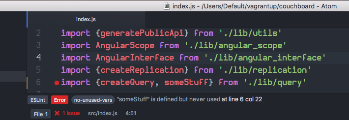
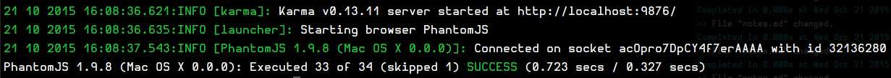
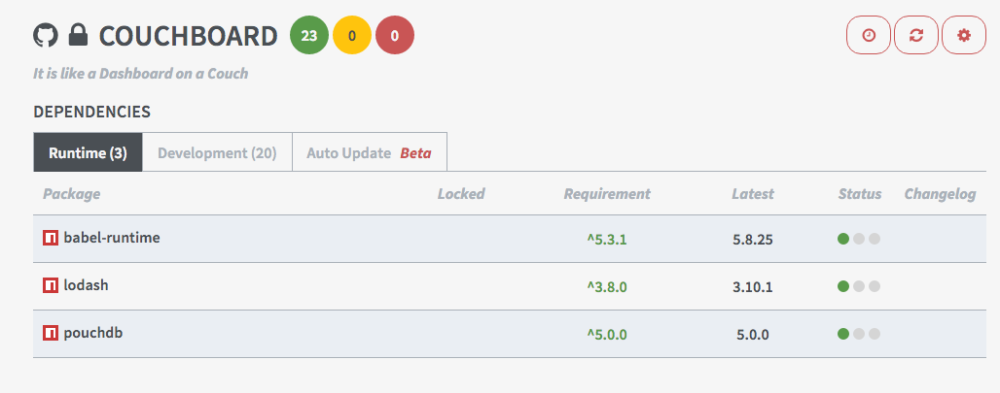

<!-- .slide: data-background="./resources/parallex_continental_breakfast.png" -->
# developmental breakfast

## numero duo

Notes:
Watch the video https://www.youtube.com/watch?v=st21dIMaGMs to
find out more about »continental breakfast«.


<!-- .slide: data-background="./resources/des_kaisers_neue_kleider.png" -->
## The Emperor's New Clothes

Notes:
- Dänisches Märchen von 1836
- Kaiser lässt sich neue Kleider nähen von zwei Scharlatanen
- Kleider seien nicht gewöhnlich
- könnten nur von Personen gesehen werden, die ihres Amts würdig und nicht dumm seien
- Aus Eitelkeit und innerer Unsicherheit erwähnt er nicht, dass er die Kleider selbst auch nicht sehen kann
- auch die Menschen, denen er seine neuen Gewänder präsentiert, geben Begeisterung über die scheinbar schönen Stoffe vor.
- Der Schwindel fliegt erst bei einem Festumzug auf, als ein Kind sagt, der Kaiser habe gar keine Kleider an, diese Aussage sich in der Menge verbreitete und dies zuletzt das ganze Volk rief.

Geschichte: https://de.wikipedia.org/wiki/Des_Kaisers_neue_Kleider
Software-Geschichte: z.B. legacy Rails-App


### Modern Frontend Tooling

> Prepare yourself for buzz words and name dropping.


```javascript
var buzz_words = ["es6", "es7", "es2015", "modules", "react", "couchdb", "hot-code-swapping", "live-reloading", "testing", "cross devise", "cross browser", "grunt", "gulp", "webpack", "broswerify", "eslint", "jshint", "jscs", "and", "so", "on", "and", "so", "forth"]
new Promise((resolve, reject) => {
  resolve(buzz_words)
}).then((buzz) => console.log('da latest in', buzz))
```

Notes:
- Ich werde nicht auf alles eingehen, aber ein paar Dinge, die wir auch im Couchboard verwenden.
- Idee ist, auf ein paar Sachen eingehen und dann Demo-Time mit couchboard und PMTool.


<!-- .slide: data-background-color="white" data-background="./resources/eslint-logo.svg"-->
### [Linting](http://eslint.org)

Notes:
- Code Conventions
- Best practices
- Syntax errors (and problems; I am looking at you, JavaScript)
- Fast feedback when writing code through editor integration


### [ESLint](http://eslint.org)
- Supports *ES2015* and *JSX*
- Pluggable
- Operates on *AST*
- More than just white space issues
- De facto standard for »grüne Wiese« [React](https://facebook.github.io/react/) projects
- airbnb styleguide available as [config](https://github.com/airbnb/javascript/tree/master/packages/eslint-config-airbnb)



Notes:
Alternatives: [JSHint](http://jshint.com/), [jscs](http://jscs.info/)


<!-- .slide: data-background="./resources/unit_testing.gif"-->
### [(Unit) Tests](https://twitter.com/hashtag/unittesting)


### [Karma](http://karma-runner.github.io/)
- Browser independent
- [SauceLabs](https://saucelabs.com/) integration
- Easily integrated into dev workflow using [PhantomJS](http://phantomjs.org/) and `karma watch`
- Battle tested
- Originally built and used by the [AngularJS](https://www.angularjs.org/) team at Google



Notes:
- Not sure, if this could be used to run tests on `node`, but `tape` could do that.
- Alternative: [tape](https://www.npmjs.com/package/tape)


### Dependency management

powered by [npm](https://www.npmjs.com/) and [gemnasium](https://gemnasium.com)



Notes:
- No funny intro slide.
- In a world where people still download, and copy and paste `jquery.min.js` into `vendor/assets` we do need to mention this.
- So all dependencies (runtime and development) are `npm` packages.
- Integrates well with the rails/ruby/ruby-gem stack through [gemnasium](https://gemnasium.com)
- Alternatives: [bower](http://bower.io/), [jspm](http://jspm.io/), [greenkeeper](http://greenkeeper.io/)


<!-- .slide: data-background-color="white" data-background="./resources/webpack-background.png"-->
### Module loading aka »bringing it all together«

powered by [webpack](https://webpack.github.io/)

- Supports *ES2015* through [Babel](http://babeljs.io/)
- Supports *hot code swapping*
- Easily integrated into dev workflow using [webpack-devserver](http://webpack.github.io/docs/webpack-dev-server.html)
- [webpack-devserver](http://webpack.github.io/docs/webpack-dev-server.html) plays nice with other backends
- De facto standard for »grüne Wiese« [React](https://facebook.github.io/react/) projects

Notes:
- Really the key to the integration into the Rails workflow: [webpack-devserver](http://webpack.github.io/docs/webpack-dev-server.html)
- Alternatves: [Require.JS](http://requirejs.org/), [browserify](http://browserify.org/)


<!-- .slide: data-background-color="white" data-background="./resources/questions.png"-->
### before we move into demo land


<!-- .slide: data-background-color="white" data-background="./resources/mr-t-demo.jpg"-->
### Demo
in some other browser tab...
see you guys later...

Notes:
Image is taken from [Why your product demo sucks, and you're losing customers as a result](https://pando.com/2013/01/22/why-your-product-demo-sucks-and-youre-losing-customers-as-a-result/)
blog post. Hence the connection to *demo*.

Demo Steps:

- Linting in atom.
- Karma tests with watch running next to atom. Break something and fix it.
- PMTool, webpack-watch: Chrome Source-Maps, Editing in Atom, Editing in Chrome.

Paying homage and looking into the future (optional):

- Do *hot-loading* demo? Maybe: https://github.com/gaearon/react-transform-boilerplate
- Show: figwheel demo or elm?

Gains:

- Integriert sich nahtlos in bestehendes Frontend ohne irgendwelche Überkreuzungen
- Testlaufzeit
- Backend-independent TDD
- Überall einsetzbar (by abstract `render(infocards)` interface)
- Easy to iterate
- Easy to add more *goodness*

Pains:

- Cognitive load for developer (two repos)
- new/different stack


### Discussion Time


### Empty slide for concentration
> ahh ...this is nice


### Next Time
- Any ideas on what to talk about next?
- Who would like to organize the next *developmental breakfast* event?
